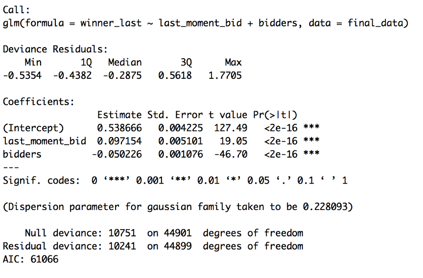
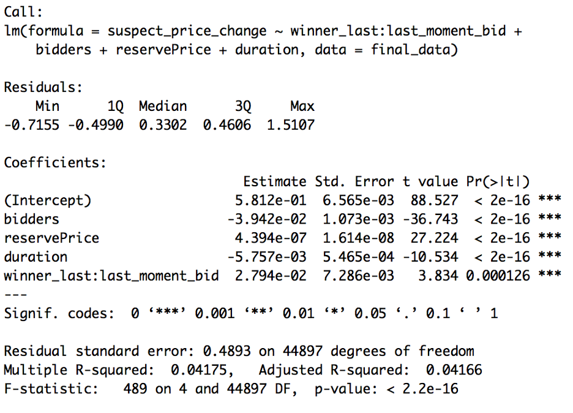
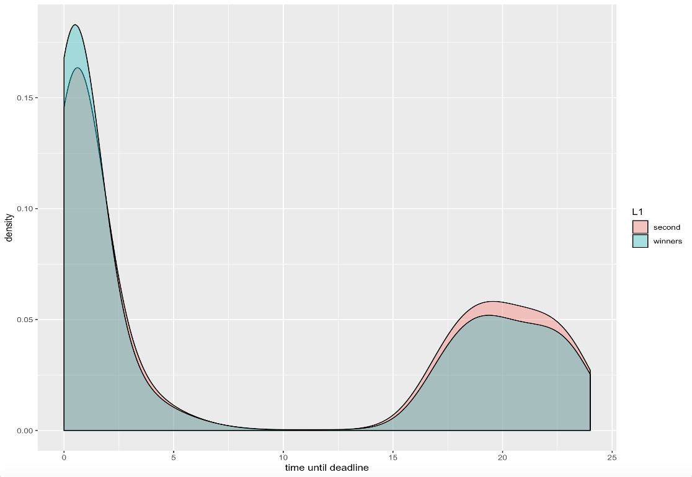
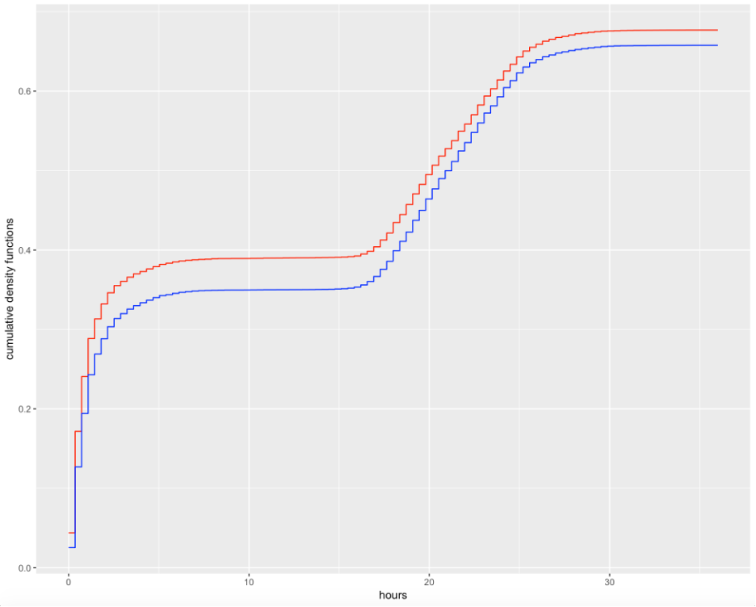
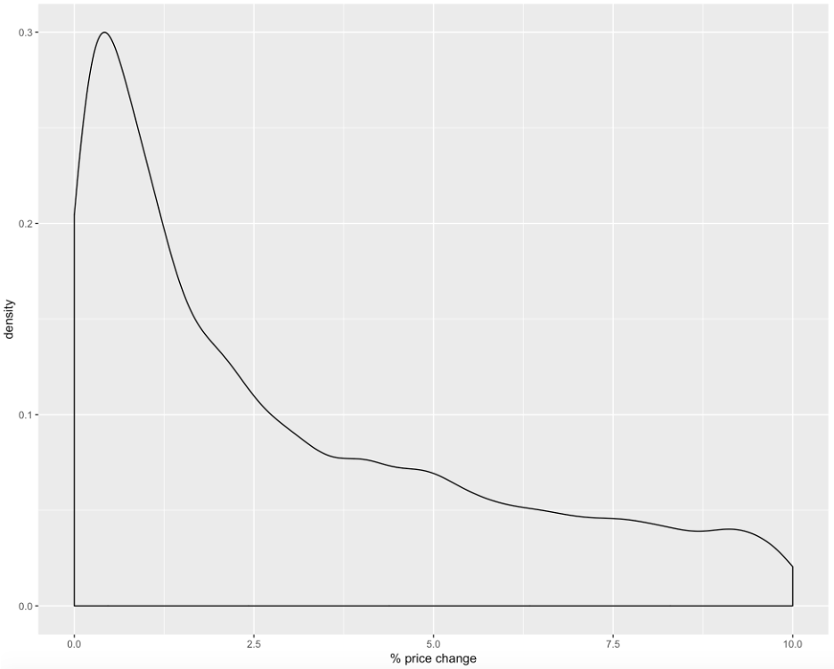

```{r setup, include=FALSE}
library(stringr)
library(XML)
library(xml2)
library(data.table)
library(dplyr)
library(ggplot2)
library(pscl)

```

Function that deals with extracting information from xml into data.table format:

```{r cars}

function_one_child<-function(x){
  #Convert to list:
  data_raw<-read_xml(x,encoding = "UTF-8")
  #Obtain children of the data_raw:
  data_children<-xml_children(data_raw)
       
  data_one_child<-unlist(as_list(data_children))
        
  #Define  function which does extraction by name:
  function_extract_names<-function(x,y){
           y[names(y)==x]
  }
    
   #Obtain unique names:
  x_names<-unique(names(data_one_child))

   #Do the extraction by name:

  data_one_child<-lapply(x_names,function_extract_names,y=data_one_child)
              
             #Then collapse multiple fields:
  data_one_child<-sapply(data_one_child,paste,collapse="&&&&")
 
  #Finally convert to data.table (notice the transpose - we do it to have a row of the data.table not the column)
  data_one_child<-data.table(t(data_one_child))
  
  setnames(data_one_child,x_names)

  names_to_extract<-c("protocolPublisher.publisherOrg.regNum","id","externalId",
                      "purchaseNumber","protocolNumber",
                      "protocolLot.applications.application.journalNumber",
                      "protocolLot.applications.application.price",
                      "protocolLot.applications.application.appDate",
                      "publishDate","docNumber",
                      "protocolPublisher.publisherOrg.fullName",
                      "protocolLot.applications.application.admittedInfo.resultType",
                      "href")
   
  #This is needed because not all archives will contain all fields:
 
  names_to_extract<-intersect(names(data_one_child),names_to_extract)

  #Extract only needed names:
  data_one_child<-subset(data_one_child,select=c(names_to_extract))
  data_one_child[,child_name:=xml_name(data_children)]
   
  data_one_child
 }
```

Function that unzips xml files and save them to corresponding csv:

```{r pressure, echo=FALSE}
#Finally write a function which parses one archive:
function_one_archive<-function(x, path_to_save){
  data_archive<-list("vector")
  list_of_xmls<-unzip(x,list=TRUE)[,1]
  list_of_xmls<-list_of_xmls[str_detect(files, 'xml')]
  for (lox in list_of_xmls){
    data_archive[[match(lox,list_of_xmls)]]<-function_one_child(x,lox)
  }
  dt<-lapply(list_of_xmls,function_one_child,x=x)
  
  dt <- Reduce(function(x,y){merge(x,y,all=TRUE,by=intersect(names(x),names(y)))},data_archive)

  fwrite(dt, file=paste(path_to_save, paste(x,'.csv')))

}

```

Saving all protocols and notifications to csv files:

```{r pressure, echo=FALSE}

#### Extract xmls to csv:
path_to_save = '/Users/mac/Desktop/research\ coruption\ data/fcs_regions/'
### Notifications:

setwd('') # path to all gos zakupki downloaded notifications
files<-list.files()

files<-files[str_detect(files,".zip")]

# saves each protocol individually each notifications to csv
for (file in files){
  function_one_archive(file, path_to_save)
}


### PROTOCOLS:

setwd('') # path to all gos zakupki downloaded protocols
files<-list.files()
files<-files[str_detect(files, 'xml')]
files<-files[str_detect(files,'ZK')]

# saves each protocol individually each proto to csv
for (file in files){
  function_one_archive(file)
}
 
```

Loading and merging all saved notifications:

```{r pressure, echo=FALSE}

setwd(path_to_save)
data_notifications<-fread("notifications_2014-2017.csv",
                          colClasses = c("character"))
data_notifications_1<-fread("notifications_moskva_2018.csv",
                            colClasses = c("character"))
data_notifications_2<-fread("notifications_moskva_2019.csv",
                            colClasses = c("character"))
dt<-rbindlist(list(data_notifications_2,data_notifications_1,data_notifications),
              use.names = TRUE,fill=TRUE)

dt<-dt[order(purchaseNumber,id,docPublishDate,decreasing = TRUE)]
dt<-unique(dt,by=c("purchaseNumber"))
dt<-dt[dt$procedureInfo.collecting.endDate!='']
dt<-dt[!is.na(dt$procedureInfo.collecting.endDate)]
dt<-dt[, procedureInfo.collecting.startDate:=
         sapply(procedureInfo.collecting.startDate,function(x){
           gsub('Z|T',' ',x, fixed = FALSE)
           })]
dt <- dt[, procedureInfo.collecting.endDate:=
           sapply(procedureInfo.collecting.endDate,function(x){
             gsub('Z|T',' ',x, fixed = FALSE)
             })] 
```

Loading and merging all saved protocols:

```{r pressure, echo=FALSE}
setwd(path_to_save)
data_protocols<-fread("protocols_2011-2019.csv",colClasses = c("character"))
data_protocols<-data_protocols[!is.na(data_protocols[,protocolLot.applications.application.appDate])]
data_protocols<-data_protocols[!(data_protocols[,protocolLot.applications.application.appDate==''])]

data_protocols<-data_protocols[order(purchaseNumber,id,decreasing = TRUE)]
data_protocols<-data_protocols[, protocolLot.applications.application.appDate:=
          sapply(protocolLot.applications.application.appDate,function(x){
            gsub('Z|T',' ',x, fixed = FALSE)
            })]  
data_protocols<-unique(data_protocols,by=c("purchaseNumber"))

```

Merging all protocols and notifications into one table and preprocessing (deleting all duplicates):

```{r pressure, echo=FALSE}

#Merge the two:
final_data<-merge(dt,data_protocols,by=c("purchaseNumber"),all.x=TRUE)
final_data <- final_data[final_data[,!is.na(protocolLot.applications.application.journalNumber)]]
 
#Keep only those observations where there are at least two bidders:
final_data<-final_data[final_data[,protocolLot.applications.application.price!=""]]
at_least_two<-final_data$protocolLot.applications.application.price
at_least_two<-sapply(strsplit(at_least_two,"&&&&"),length)
final_data<-final_data[at_least_two>=2]
 
#Keep only those observations where all submitted bids are different;
function_different<-function(x){
  sum(duplicated(x))
}
 
duplicated_bids<-final_data$protocolLot.applications.application.price
duplicated_bids<-sapply(strsplit(duplicated_bids,"&&&&"),function_different)
final_data<-final_data[duplicated_bids==0]
 
#Keep only those observations where all submission times are different;
duplicated_time<-final_data$protocolLot.applications.application.appDate
duplicated_time<-sapply(strsplit(duplicated_time,"&&&&"),function_different)
final_data<-final_data[duplicated_time==0]
 


```
$$ \large \text{suspect price change}_i = \text{winner last}_i*\text{last moment bid}_i+bidders_i+\text{reserve  price}_i+duration_i+ ε_i
\\[0.3in]
\LARGE \text{Creating all needed variables for analysis of auctions:}
\\[0.3in]
\\ 
\\
\text{suspect price change} _i = \begin{cases} 1 \text{,  if the} \frac{\text{ second min⁡ bid - winning bid}}{\text{second min bid}}\text{ ≤1% } \\ 0 \text{,       otherwise} \end{cases}
\\
\\ \text{winner last}_i =\begin{cases} 1 \text{,   if the winning bid was placed last}\\0 \text{,   otherwise}\end{cases}
\\
\\ \text{last moment bid}_i = \begin{cases}1 \text{,   if bid was made during last 15 minutes before deadline} \\ 0 \text{,     otherwise} \end{cases}  $$
```{r pressure, echo=FALSE}

function_second_min<-function(x){
  sort(x)[2]
}
function_second_min_1<-function(x){
  which(sort(x)[2] == x)
}
 
bids<-final_data$protocolLot.applications.application.price
bids<-lapply(strsplit(bids,"&&&&"),as.numeric)

#creating variable duration of auction
d2 <- as.Date(substr(dt$procedureInfo.collecting.endDate,1,10))
d1 <- as.Date(substr(dt$procedureInfo.collecting.startDate,1,10))
dt[,days:= d2 - d1]
 
final_data[,min_bid:=sapply(bids,min)]
final_data[,second_min_bid:=sapply(bids,function_second_min)]
bid_time<-final_data$protocolLot.applications.application.appDate
bid_time<-strsplit(bid_time,"&&&&")

function_last_bid<-function(x){
  strptime(substr(x,1,19),'%Y-%m-%d %H:%M:%S')
}
 
function_substitute<-function(x){
   trimws(gsub("Z|T"," ",x))
}

#Obtain winner time:
last_bidder<-sapply(bid_time,max)

bid_time<-lapply(bid_time,function_substitute)
 

function_which_max<-function(x){
  which(x %in% max(x))
}
 
winner_time_1<-sapply(bid_time,function_which_max)
winner_time_2<-sapply(bids,which.min)
 
final_data[,last_bidder:=last_bidder]
final_data[,last:=sapply(last_bidder,function(x){as.POSIXct(substr(x,1,19))})]
final_data[,timestamp:=sapply(procedureInfo.collecting.endDate,function(x){as.POSIXct(substr(x,1,19))})]
final_data[,adjusted_procedureInfo.collecting.endDate:=
              procedureInfo.collecting.endDate][timestamp<last,adjusted_procedureInfo.collecting.endDate:=last_bidder]
final_data[,timestamp:=sapply(adjusted_procedureInfo.collecting.endDate,function(x){as.POSIXct(substr(x,1,19))})]

 
final_data[,last_moment_bid:=ifelse((timestamp-last)/3600<0.25,1,0)]
 
winner_last<-ifelse(winner_time_1==winner_time_2,1,0)
final_data[,winner_last:=winner_last]


 
#Create a suspicious variable:
final_data[,suspect_price_change:=
              ifelse(abs((min_bid-second_min_bid)/second_min_bid)<=0.05,1,0)]
 
#Create some additional variables:
nr_bidders<-final_data$protocolLot.applications.application.price
nr_bidders<-sapply(strsplit(nr_bidders,"&&&&"),length)
final_data[,nr_bidders:=nr_bidders]
final_data[,lot.customerRequirements.customerRequirement.maxPrice:=
              as.numeric(lot.customerRequirements.customerRequirement.maxPrice)]
final_data[,days:=as.numeric(days)]


```


```{r cars}
summary(lm(suspect_price_change~winner_last:last_moment_bid+bidders+reservePrice+duration,data=final_data))

summary(glm(winner_last~last_moment_bid + bidders ,data = final_data))

summary(glm(suspect_price_change~(winner_last:last_moment_bid)+bidders+reservePrice+duration,data=final_data, family = "binomial"))

summary(glm(suspect_price_change~winner_last:last_moment_bid+bidders+lot.customerRequirements.customerRequirement.maxPrice+days, family =  binomial(link = "probit"), 
                data= final_data))

```
```{r pressure, echo=FALSE, fig.cap="A caption", out.width = '50%'}


```

```{r cars}
##ggplot

time_it <-0
winner_dur<-function (x){
   time_it <<- time_it+1
   as.POSIXct(substr(bid_time[[time_it]][x],1,19))
}
winner_pos<-sapply(bids,which.min)
winner_pos_1<-sapply(bids,function_second_min_1)
time_it <-0
win_time<-sapply(winner_pos, winner_dur)
time_it <-0
win_time_1<-sapply(winner_pos_1, winner_dur)
delta<-(final_data[,timestamp]-win_time)/3600
delta_1<-(final_data[,timestamp]-win_time_1)/3600

###pdf
dt<-list(winners=delta,second=delta_1)
dt <- melt(dt)
ggplot(dt,aes(x=value, fill=L1)) + geom_density(alpha=0.4) +  xlim(0, 24)+ labs(x="time until deadline")

###cdf
ks.test(delta,delta_1)
#p-value low thus we reject similarity of distributions


ecdf2<-ecdf(delta)
ecdf3<-ecdf(delta_1)

ll <- Map(f  = stat_function, colour = c('red', 'blue'),
          fun = list(ecdf2, ecdf3), geom = 'step')


ggplot(data = dt, aes(x = value)) + ll + xlim(0, 24)+ labs(y="cumulative density functions", x = 'hours')

  ####price change graph
ggplot(final_data,aes(x=abs(((min_bid-second_min_bid)/second_min_bid)*100))) + geom_density(alpha=0.4) +  xlim(0, 10
                                                                                              )+ labs(x="% price change")
                                                                                                                  

```
```{r pressure, echo=FALSE, fig.cap="A caption", out.width = '50%'}




```
